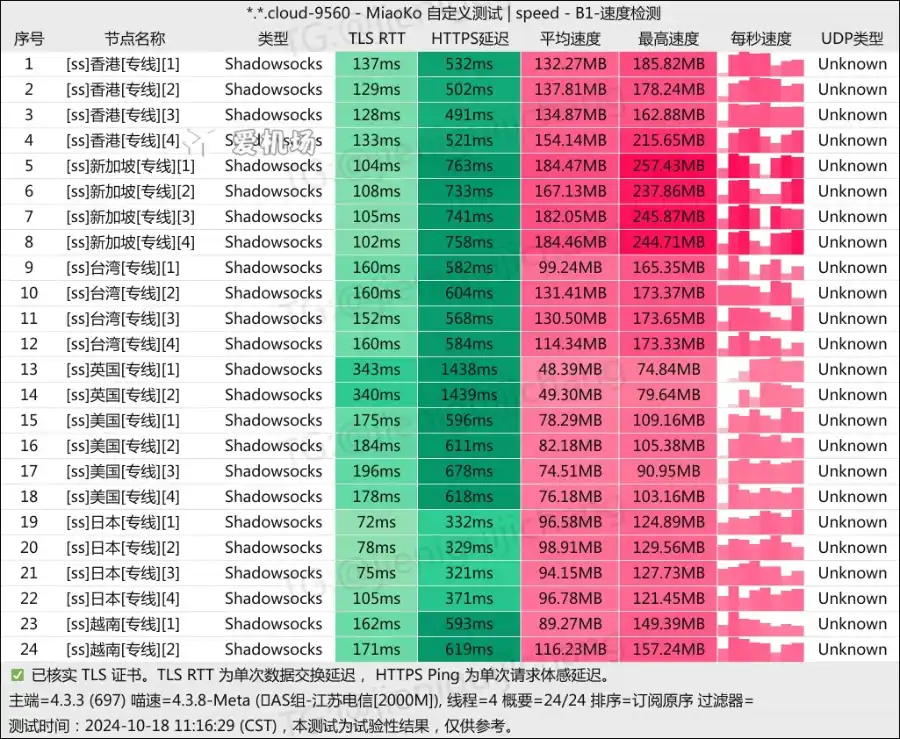

# Lray

Lray机场 – 高性价比跨境网络互联服务。

Lray机场致力于提供高性价比的跨境网络互联服务。为您量身定制的网络加速服务，Lray为您提供全球高速网络加速服务，解锁全球网络限制，让您畅游互联网。

## Lray机场特点

### 高可用跨境链路

采用IEPL专线，不管是高峰期还是敏感期都能提供优秀的网络体验。

### 无审计网络

我们的服务没有任何审计行为，您可以安全自由无束享受互联网。

### 多平台支持

支持iOS、macOS、Android、Windows、路由器、Linux等多平台。

### 先进的解锁技术

全节点解锁Netflix等主流流媒体服务，解锁ChatGPT访问。

## 全球网络节点

Lray在全球10个国家和地区部署了30+个优质网络节点，入口通过中国大陆IEPL专线为您提供高速稳定的网络加速。

*   30+原生IP节点，包括香港，台湾，日本，美国，新加坡，英国，越南等地区；
*   解锁Netflix、Hulu、HBO、TVB、Disney+等流媒体视频和ChatGPT；
*   采用高可用性的专线，高峰期流畅，敏感期可用；
*   无任何审计访问，您可以自由无束享受互联网；
*   全面支持多种设备，所有套餐均不限制设备使用量，只有流量和速率区分。

## Lray机场测速

Lray机场测速

## 选择订阅套餐

| 套餐  | 流量  | 价格  | 带宽速率 |
| --- | --- | --- | --- |
| 基础  | 100 GB | ¥9.90 / 月 | 100mbps |
| 标准  | 200 GB | ¥16.90 / 月 | 200mbps |
| 高级  | 500 GB | ¥29.90 / 月 | 500mbps |
| 精英  | 1000 GB | ¥49.90 / 月 | 1000mbps |
| 终极  | 2000 GB | ¥69.90 / 月 | 2000mbps |
| 终极 Plus | 5000 GB | ¥99.90 / 月 | 5000mbps |
| 轻量  | 30 GB | ¥49.00 / 年 | 100mbps |
| 轻量 Plus | 60 GB | ¥69.00 / 年 | 100mbps |

## 常见问题

### 你们安全可靠吗？

我们的团队来自于海外，我们承诺不记录任何日志，不向第三方提供信息。

### 支持多少个设备同时使用？

我们不限制设备的数量使用，你可以共享给家人使用。

### 可以升/降级套餐吗？

你可以在用户中心自主升级或降级套餐，系统会计算差价。

### 流量什么时候重置？

每个月的账单日会自动重置流量，且流量不会叠加。

### 你们接受哪些付款方式？

支持支付宝或者USDT/BTC等主流支付方式。

### 可以解锁哪些服务？

Netflix、Hulu、HBO、TVB、Disney+等在内的多种流媒体和ChatGPT等AI工具。

### 支持在哪些平台使用？

支持Windows、macOS、Android、Linux、OpenWRT等主流操作系统，同时我们也有官方的客户端供您选择使用。

如还有其他问题请点击右下角联系我们的客服，我们会积极热情为你解答。

> Lray机场 - 中转机场，定制三端：访问[官网](https://jump.p6p.net/226)订阅。
